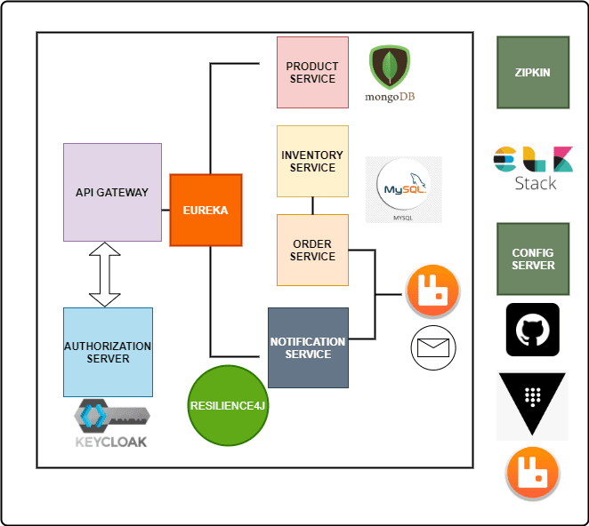

# Spring Cloud Microservices Tutorial

Welcome to the Spring Cloud Microservices Tutorial series! In this tutorial series, we will explore various modules of Spring Cloud that help us build robust microservices using the Spring Framework.

## Table of Contents

- [Introduction](#introduction)
- [Spring Cloud Config Server](#spring-cloud-config-server)
- [Spring Cloud Bus](#spring-cloud-bus)
- [Spring Cloud Netflix Eureka](#spring-cloud-netflix-eureka)
- [Spring Cloud Circuit Breaker](#spring-cloud-circuit-breaker)
- [Spring Cloud Sleuth](#spring-cloud-sleuth)
- [Spring Cloud Gateway](#spring-cloud-gateway)
- [Spring Cloud Stream](#spring-cloud-stream)
- [Distributed Logging using ELK Stack](#distributed-logging-using-elk-stack)
- [Sample Project Architecture](#sample-project-architecture)

## Introduction

The main module that helps us write microservices using the Spring Framework is Spring Cloud. In this tutorial series, we will mainly concentrate on the following modules, which are part of Spring Cloud:

## Spring Cloud Config Server

Spring Cloud Config Server is used to externalize the configuration of our microservices into a centralized place. When there are changes in the configuration, our applications can be updated without the need to restart them. This module provides options to implement centralized configuration, e.g., using a Git Repository or HashiCorp Consul. We will also use HashiCorp Vault as one of the backends to maintain secrets for our application.

## Spring Cloud Bus

The Spring Cloud Bus module contains a lightweight message broker implementation used to broadcast messages to other services. In our project, we will use this module to broadcast configuration changes in our Config Server.

## Spring Cloud Netflix Eureka

Spring Cloud Netflix Eureka is used to implement the Service Registry and Discovery Pattern in Microservices architecture. It provides a reliable way to scale services and enable inter-service communication without hard-coding service information. This module uses Netflix’s Eureka library to provide this functionality. Other alternatives include Spring Cloud Consul and Spring Cloud Zookeeper.

## Spring Cloud Circuit Breaker

Inter-service communication is common in the Microservices architecture. If one of the services is down, the other service communicating with it should be able to handle this failure gracefully. Spring Cloud Circuit Breaker provides an abstraction over different Circuit Breaker implementations like Resilience4J, Hystrix, Sentinel, etc. In our project, we will use Spring Cloud Circuit Breaker with Resilience4J.

## Spring Cloud Sleuth

In Microservice Architecture, debugging and tracing errors can be challenging. Spring Cloud Sleuth provides the functionality to trace inter-service calls.

## Spring Cloud Gateway

Spring Cloud Gateway helps us implement the API Gateway pattern by hiding the complexity of our microservices from external clients. All traffic goes through the API Gateway, which routes requests to the appropriate service. It also handles cross-cutting concerns like security, monitoring, rate-limiting, and resiliency. We will secure our microservices using Keycloak as an Authorization Server together with the Spring Cloud Gateway.

## Spring Cloud Stream

Spring Cloud Stream allows us to implement asynchronous communication between our microservices using an event-driven architecture. We will use RabbitMQ as a message broker to implement event-driven microservices.

## Distributed Logging using ELK Stack

While not part of the Spring Cloud Stack, we will implement Centralized Logging for our microservices using the ELK Stack (Elasticsearch, Logstash, and Kibana).

## Sample Project Architecture

As part of this tutorial, we will build a Simple Online Shopping Application. The main focus of this tutorial is to explain Microservices Architecture and its implementation, so the functionality of the application will be minimal. We will implement the following services:

- Product Service
- Order Service
- Inventory Service
- Notification Service

Let's embark on this journey to explore the world of Spring Cloud Microservices!

[Spring Initializer Configuration](https://start.spring.io/#!type=maven-project&language=java&platformVersion=3.1.3&packaging=jar&jvmVersion=17&groupId=com.springmicroservices&artifactId=product-service&name=product-service&description=Product%20Service&packageName=com.springmicroservices.product-service&dependencies=lombok,web,data-mongodb)

